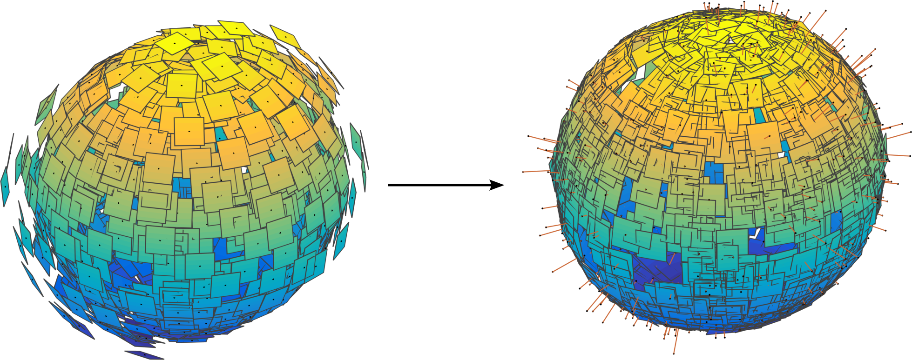

Implementation of [1] written in MATLAB and C++.



The code uses the roof duality code from [2].

The code has been tested on:
* Windows 7, MATLAB 2015a, Visual Studio 2013.
* Ubuntu 14.04, MATLAB 2015a, GCC 4.8.2.


Getting started 
----------
The code requires [https://github.com/petters/spii](SPII). 


#### Windows 
Update include/compile_script.m with the correct folders to Eigen and SPII.

#### Examples
A good place to start is with the two scripts:  
* examples/example_2D.m
* examples/example_3D.m

#### Extend

If you like to add a new cost function update three files and remove the old mex files:

* __include/PointCloud.h__ add a new functor, e.g: 
```
class My_regularization { ...
```

* __include/mex_wrapper.h__ update with the new functor, e.g.:

```
...
} else  if (!strcmp(problem_type,"my_cost")){
main_function<Quadratic_data, My_regularization>(nlhs, plhs, nrhs, prhs);
} else 
...
```

* __PointCloud.m__ update to allow the new cost function, e.g:
```
case {'linear','quadratic', 'default', 'length', 'my_cost'}
```

* Remove the mex-files in /include

* You can now switch to the new function as:
```
Obj.cost_function = 'myCost';
```

#### Code authors
* Johannes Ulén
* Carl Olsson

References
----------

1. __Curvature-based regularization for surface approximation__. <br />
IEEE Conference on Computer Vision and Pattern Recognition, 2012 <br />
_C. Olsson and Y. Boykov_.

2. __Optimizing binary MRFs via extended roof duality__. <br />
IEEE Conference on Computer Vision and Pattern Recognition, 2007. <br />
_C. Rother, V. Kolmogorov, V. Lempitsky, and M. Szummer_.
